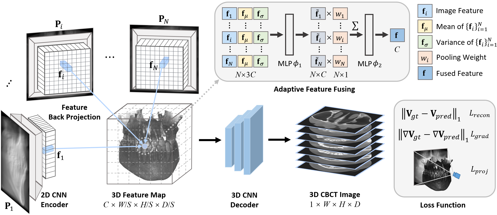
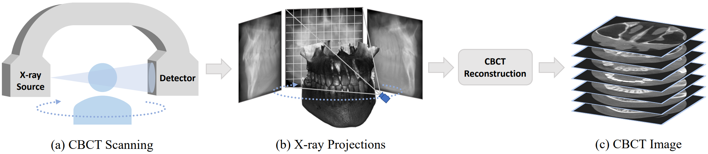

# Geometry-Aware Attenuation Learning for Sparse-View CBCT Reconstruction
[Zhentao Liu](https://zhentao-liu.github.io/), [Yu Fang](https://yuffish.github.io/), [Changjian Li](https://enigma-li.github.io/), [Han Wu](http://hanwu.website/), [Yuan Liu](https://liuyuan-pal.github.io/), [Dinggang Shen](https://idea.bme.shanghaitech.edu.cn/), and [Zhiming Cui](https://shanghaitech-impact.github.io/)

## [Paper](https://ieeexplore.ieee.org/document/10705334) | [Arxiv](https://arxiv.org/abs/2303.14739) | [Project Page](https://shanghaitech-impact.github.io/Geometry-Aware-Attenuation-Learning-for-Sparse-View-CBCT-Reconstruction/)

This is the official repo of our paper **Geometry-Aware Attenuation Learning for Sparse-View CBCT Reconstruction** in **IEEE TMI 2024**. In this work, we describe a novel encoder-decoder framework for sparse-view CBCT reconstruction which integrates the inherent geometry of CBCT scanning system. It produces high quality CBCT reconstructions with sparse input (20 views or less) in a time-efficient manner, which aims to reduce radiation exposure.

### Updated Feature
We have provide a new `angle2vec` function in `models/render.py` that incorporates both `PrimaryAngle` and `SecondaryAngle`, which are commonly used in real-world CBCT scanning system. You may refer to [DICOM Geometry](https://dicom.innolitics.com/ciods/x-ray-angiographic-image/xa-positioner/00181510) for more details about these two angles. And in our paper, we only consider about `PrimaryAngle` (rotation angle in our paper), assuming `SecondaryAngle` is set to zero by default. 

## Setup
First clone this repo. And then set up an environment and install packages. We use single A100 80G GPU card for training. Make sure you have enough resources.

    git clone https://github.com/Zhentao-Liu/Sparse-View-CBCT-Reconstruction.git
    cd Sparse-View-CBCT-Reconstruction
    conda create -n CBCTrecon python=3.8
    conda activate CBCTrecon
    pip install torch==2.1.2+cu118 torchvision==0.16.2+cu118 --extra-index-url https://download.pytorch.org/whl/cu118
    pip install -r requirements.txt

## Dataset-Preparation

### Dental Dataset (Simulated)
We provide the preprocessed dental CBCT volumes in BaiduDesk. 130 cases in total, including 100 cases for training, 10 cases for validation, and 20 cases for testing. You may download them, and then put them in a self-built folder `./dataset/dental/raw_volume`. As for X-ray simulation, please refer to [DRR-Simulation](#DRR-Simulation).

### Spine Dataset (Simulated)
As for the spinal dataset, please refer to [CTSpine1K](https://github.com/MIRACLE-Center/CTSpine1K) for more details. We provide the preprocessed spine CT volumes in BaiduDesk. 130 cases in total, including 100 cases for training, 10 cases for validation, and 20 cases for testing. You may download them, and then put them in a self-built folder `./dataset/spine/raw_volume`. As for X-ray simulation, please refer to [DRR-Simulation](#DRR-Simulation).
### Walnut Dataset (Real-World)
As for the walnut dataset, please refer to [WalnutScan](https://github.com/cicwi/WalnutReconstructionCodes) for more details. It is a large-scale real-world walnut CBCT scans dataset collected for machine learning purpose. Many thanks to this great work. We provide the preprocessed walnut CBCT volumes, real-world projections, and geometry description files in BaiduDesk. 42 cases in total, including 32 cases for training, 5 cases for validation, and 5 cases for testing. You may download them, and then put them in a self-built folder `./dataset/walnut`.

Dataset link: [BaiduDesk](https://pan.baidu.com/s/1fDVFzLQhCw_PDU8Z94KiaQ); Code: z6m7; The dataset split is set as default in `./data/dataset_split`.

## DRR-Simulation

In our experiments, we apply Digitally Reconstructed Radiography (DRR) technique to simulate 2D X-ray projections of given 3D CBCT/CT volumes from dental/spine dataset. You need to first prepare your datasets as instructed in [Dataset-Preparation](#Dataset-Preparation). Then, run the following command.

    # for dental dataset
    python DRR_simulation.py --start=0 --end=360 --num=360 --sad=500 --sid=700 --datapath=./dataset/dental
    # for spine dataset
    python DRR_simulation.py --start=0 --end=360 --num=360 --sad=1000 --sid=1500 --datapath=./dataset/spine

In this way, you will get a data folder `./dataset/dental/syn_data` or `./dataset/spine/syn_data` that containing synthesized X-ray projections and geometry description files for each scanned object. It will generate 360 projections uniformly spaced within the angle range of [0, 360).

## Train
After preparing the dataset and X-ray simulation, you could run the following command to train your model.

    python train.py -n=<Expname> -D=./dataset/dental/syn_data --datatype=dental --train_scale=4 --fusion=ada --start=0 --end=360 --nviews=20 --angle_sampling=uniform --is_train 

In this way, you would train a model with 20 input views uniformly spaced within [0, 360) on dental dataset. The downsampling rate during training S=4, and it adopts adaptive feature fusing strategy proposed in our paper. Other hyperparameters are set as default. You may modify these hyperparamters to train your own model. The training process may take about 20 hours util convergence.

## Evaluate
Once the above training converged, you could run the following command to evaluate your model on test dataset.

    python evaluate.py -n=<Expname> -D=./dataset/dental/syn_data --datatype=dental --train_scale=4 --fusion=ada --start=0 --end=360 --nviews=20 --angle_sampling=uniform --eval_scale=4 --resume_name=200

In this way, it would test the model with 20 input views uniformly spaced within [0, 360) on dental dataset. The downsampling rate during evaluation S=4. Resumed from 200 epoch. You may modify these hyperparameters to evaluate your own model.

## Contact
There may be some errors during code cleaning. If you have any questions on our code or our paper, please feel free to contact with the author: liuzht2022@shanghaitech.edu.cn, or raise an issue in this repo. 

## Citation
If you find this work is useful for you, please cite our paper.

    @ARTICLE{SVCT,
          author={Liu, Zhentao and Fang, Yu and Li, Changjian and Wu, Han and Liu, Yuan and Shen, Dinggang and Cui, Zhiming},
          journal={IEEE Transactions on Medical Imaging}, 
          title={Geometry-Aware Attenuation Learning for Sparse-View CBCT Reconstruction}, 
          year={2024},
          doi={10.1109/TMI.2024.3473970}
    }

## Related Links
- Accurate CBCT scanning geometry description (source, detector, uvector, vvector) is inspired by [WalnutScan](https://github.com/cicwi/WalnutReconstructionCodes) and [Astra-toolbox](https://github.com/astra-toolbox/astra-toolbox).
- Parts of our code are adapted from [PixelNeRF](https://github.com/sxyu/pixel-nerf) implementation.
- Pioneer NeRF-based framework for CBCT reconstruction: [NAF](https://github.com/Ruyi-Zha/naf_cbct), [SNAF](https://arxiv.org/abs/2211.17048).
- Check the concurrent work [DIF-Net](https://github.com/xmed-lab/DIF-Net) and its improvement [C2RV](https://github.com/xmed-lab/C2RV-CBCT) which also combine feature backprojection and generalization ability to solve sparse-view CBCT reconstruction as we do.

Thanks to all these great works.
